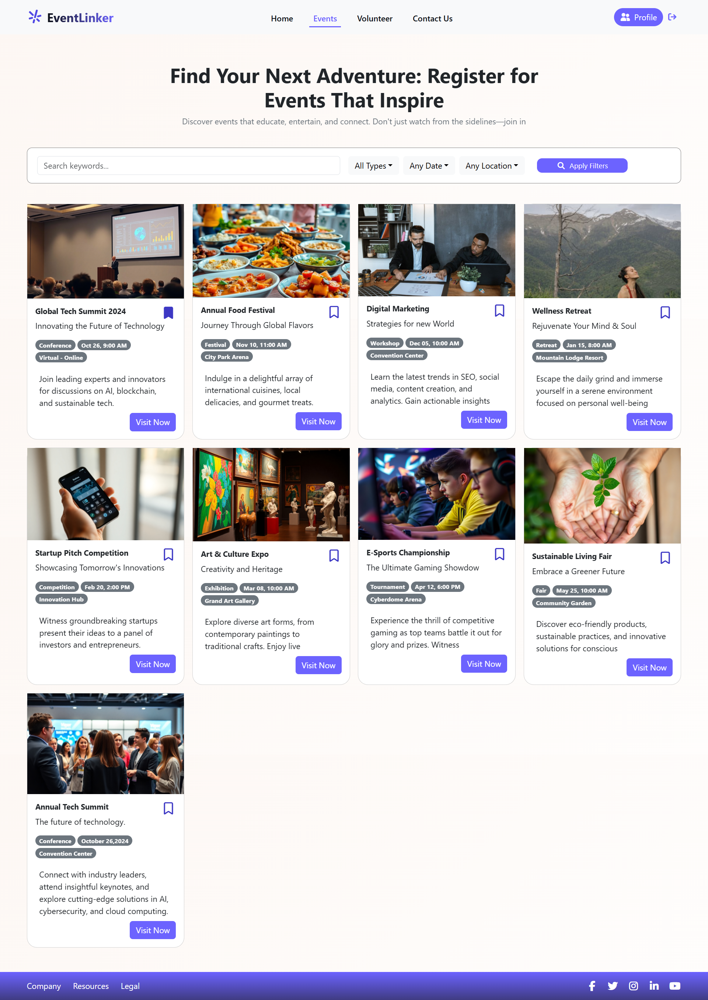
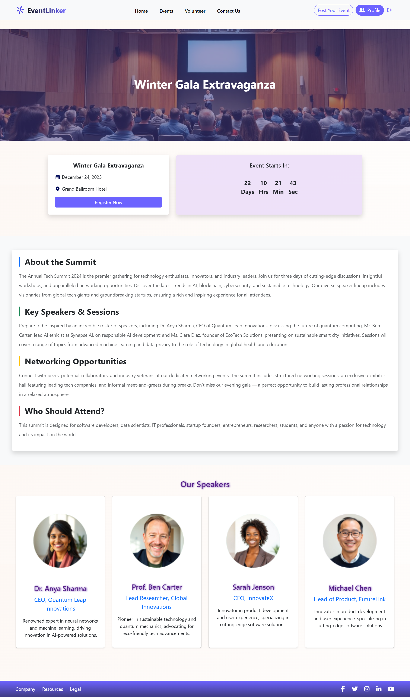
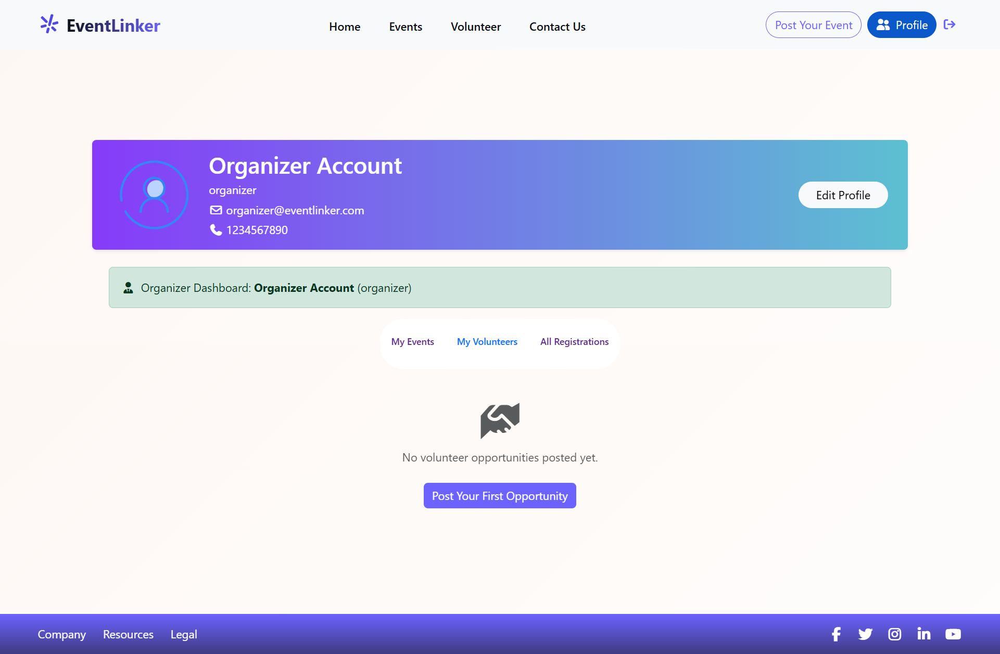
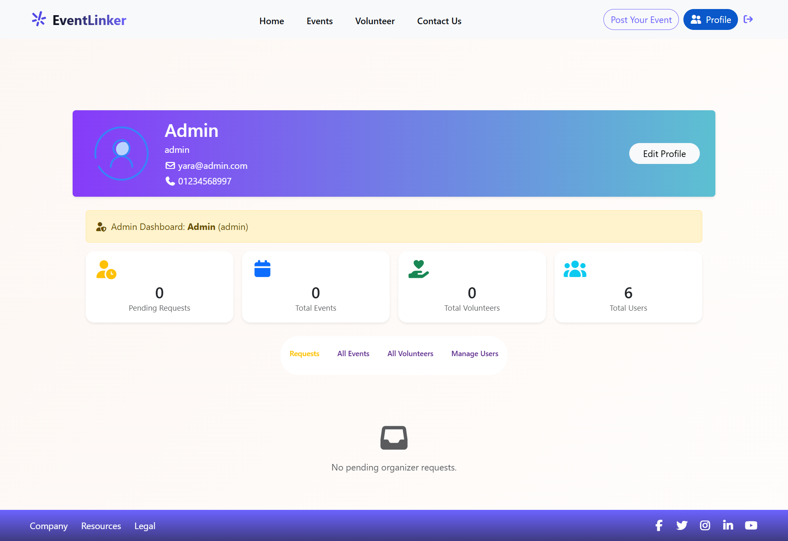

# EventLinker

EventLinker is a youth & cultural events platform that allows users to discover, join, and share events.  
It also supports volunteering opportunities, posting new events, and contacting the organizers directly.

---

## Table of Contents

- [EventLinker](#eventlinker)
  - [Table of Contents](#table-of-contents)
  - [Key Features](#key-features)
    - [Feature 1: Homepage](#feature-1-homepage)
    - [Feature 2: Sign In Page](#feature-2-sign-in-page)
    - [Feature 3: Sign Up Page](#feature-3-sign-up-page)
    - [Feature 4: Events Page](#feature-4-events-page)  
    - [Feature 5: Volunteering Page](#feature-5-volunteering-page)
    - [Feature 6: Event Details](#feature-6-event-details)
    - [Feature 7: Post Event](#feature-7-post-event)
    - [Feature 8: Contact Us](#feature-8-contact-us)
    - [Feature 9: Profile Page](#feature-9-profile-page)  
  - [User Roles & Permissions](#user-roles--permissions)
  - [Technologies Used](#technologies-used)
  - [Installation Guide](#installation-guide)
  - [Role-Based Email System](#role-based-email-system)
  - [Profile Management](#profile-management)


---

## Key Features

### Feature 1: Homepage

#### Feature 1 Live Design Preview
  
*Fig 1.1 - Homepage showcasing featured events and navigation*

---

**Description:**  
- Main landing page of the Website.  
- Displays highlighted events and provides easy navigation across the platform.  
- Entry point for discovering activities.

**Key Functionalities:**
- View featured events
- Navigate to volunteering, event details, and other pages
- Search for events

---

### Feature 2: Sign In Page

#### Feature 2 Live Design Preview
  
*Fig 2.1 - User login page with secure authentication*

---

**Description:**  
- Secure login page for registered users.
- Validates user credentials and provides access based on assigned role.
- Simple and clean interface for quick access.

**Key Functionalities:**
- Email and password authentication
- Form validation
- Redirect to signup page for new users
- Role-based dashboard redirect after login
- Error handling for incorrect credentials

---

### Feature 3: Sign Up Page

#### Feature 3 Live Design Preview
  
*Fig 3.1 - User registration form with role assignment*

---

**Description:**  
- Registration page for new users to create an account.
- Automatic role assignment based on email domain.
- Comprehensive form validation to ensure data quality.

**Key Functionalities:**
- Full name, email, phone, and password input
- Password confirmation matching
- Email domain-based role assignment (User, Organizer, Admin, Super Admin)
- Phone number validation (7-15 digits)
- Password strength requirement (minimum 6 characters)
- Duplicate email detection
- Redirect to login after successful registration

---

### Feature 4: Events Page

#### Feature 4 Live Design Preview
  
*Fig 4.1 - Events listing page with filters and categories*

---

**Description:**  
- A dedicated page for browsing all events on the platform.
- Users can search and filter events based on categories, dates, or locations.

**Key Functionalities:**
- Display events in a clean, card-based layout
- Filter by event type (conference, workshop, exhibition, etc.)
- Filter by date and location
- Keyword-based search bar
- Save events as favorites (bookmark)
- "Visit Now" button to navigate to event details
- Responsive grid layout for different screen sizes

---

### Feature 5: Volunteering Page

#### Feature 5 Live Design Preview
  
*Fig 5.1 - Volunteering opportunities listing*

---

**Description:**  
- Dedicated page for volunteering opportunities.  
- Users can explore activities to participate in and contribute to the community.

**Key Functionalities:**
- Browse volunteering events
- View details about each opportunity
- Apply or register to volunteer

---

### Feature 6: Event Details

#### Feature 6 Live Design Preview
  
*Fig 6.1 - Full event details page with description and registration options*

---

**Description:**  
- Provides complete details of a selected event.  
- Helps users understand the purpose, date, time, and location of the event.

**Key Functionalities:**
- View event description, date, and location
- Option to register
- Show the Speakers of the Event

---

### Feature 7: Post Event

#### Feature 7 Live Design Preview
  
*Fig 7.1 - Add new event post form*

---

**Description:**  
- Allows Organizers or admins to add new event posts.  
- Keeps the platform updated with new activities.

**Key Functionalities:**
- Input form for event details (title, description, category, date)
- Upload images or flyers
- Publish event to homepage

---

### Feature 8: Contact Us

#### Feature 8 Live Design Preview
  
*Fig 8.1 - Contact form for inquiries and support*

---

**Description:**  
- A simple page to let users contact the team for support or questions.  
- Includes form submission and team contact info.

**Key Functionalities:**
- Contact form (Name, Email, Message)
- Social media links
- Email/phone support details

---

### Feature 9: Profile Page

#### Feature 9 Live Design Preview

**User Profile:**
  
*Fig 9.1 - User profile with basic access and event tracking*

**Organizer Profile:**
  
*Fig 9.2 - Organizer profile with event management capabilities*

**Admin Profile:**
  
*Fig 9.3 - Admin profile with platform moderation tools*

**Super Admin Profile:**
  
*Fig 9.4 - Super Admin profile with full system control*

---

**Description:**  
- A personal page for each registered user that shows their basic details, activities on the platform, and the events they have registered for.
- Profile interface adapts based on user role, showing relevant tools and permissions.

**Key Functionalities:**
- Display profile information (name, email, photo, phone number, role)
- Role-specific dashboard content
- Manage user's own events (edit/delete)
- Cancel event registrations
- Track volunteering opportunities (Active – Pending – Withdrawn)
- **Edit profile details** (name, email, phone, password)
- **Upload and manage profile picture**
- **Change password securely** with old password verification
- Logout from account

**Role-Specific Features:**

| Feature | User | Organizer | Admin | Super Admin |
|---------|------|-----------|-------|-------------|
| View Profile | ✅ | ✅ | ✅ | ✅ |
| Edit Profile | ✅ | ✅ | ✅ | ✅ |
| Change Password | ✅ | ✅ | ✅ | ✅ |
| My Events | ❌ | ✅ | ✅ | ✅ |
| Create Events | ❌ | ✅ | ✅ | ✅ |
| Moderate Content | ❌ | ❌ | ✅ | ✅ |
| Manage Users | ❌ | ❌ | ✅ | ✅ |
| System Settings | ❌ | ❌ | ❌ | ✅ |

---

## User Roles & Permissions

EventLinker supports **4 distinct user roles**, each with specific permissions and access levels. Roles are automatically assigned based on the email domain used during registration.

| Role | Email Domain | Access Level | Permissions |
|------|-------------|--------------|-------------|
| **User** | Any domain (default) | Basic | Browse events, register for events, volunteer, save favorites |
| **Organizer** | @organizer.com | Event Management | All User permissions + Create/Edit/Delete own events, manage event registrations |
| **Admin** | @admin.com | Platform Management | All Organizer permissions + Moderate content, manage users, review reports |
| **Super Admin** | @superadmin.com | Full Control | All permissions + System settings, user role management, platform configuration |

### Example Accounts by Role:

```
User Role:
- john@gmail.com
- sara@yahoo.com
- ahmed@outlook.com

Organizer Role:
- events@organizer.com
- culture@organizer.com
- youth@organizer.com

Admin Role:
- support@admin.com
- moderator@admin.com
- team@admin.com

Super Admin Role:
- boss@superadmin.com
- root@superadmin.com
- owner@superadmin.com
```

---

## Technologies Used

### Frontend
- **React 18** - JavaScript library for building user interfaces
- **React Bootstrap** - UI component library
- **React Router DOM** - Navigation and routing
- **Font Awesome** - Icon library

### Storage & Data
- **LocalStorage API** - Client-side data persistence

### Styling
- **CSS3** - Custom styling
- **Bootstrap 5** - Responsive grid system and components

---

## Installation Guide

### Prerequisites
- Node.js (v14 or higher)
- npm or yarn package manager
- Modern web browser

### Installation Steps

1. **Clone the repository**
```bash
git clone <repository-url>
cd eventlinker
```

2. **Install dependencies**
```bash
npm install
```

3. **Install required packages**
```bash
npm install react-bootstrap bootstrap
npm install react-router-dom
npm install @fortawesome/fontawesome-free
```

4. **Start the development server**
```bash
npm start
```

5. **Open in browser**
```
http://localhost:3000
```

The application will automatically open in your default browser.

---

## Role-Based Email System

### How It Works

The system automatically assigns user roles based on the email domain entered during signup:

```javascript
// Domain to Role Mapping
const domainRoleMap = {
  "organizer.com": "organizer",
  "admin.com": "admin",
  "superadmin.com": "superadmin",
  // Any other domain defaults to "user"
};
```

### Choosing Your Role During Signup

When creating an account, **use the appropriate email domain** to get the desired role:

#### For Regular User Access:
Use any common email provider:
- `yourname@gmail.com`
- `yourname@yahoo.com`
- `yourname@outlook.com`

#### For Organizer Access:
Use the organizer domain:
- `yourname@organizer.com`
- `events@organizer.com`

#### For Admin Access:
Use the admin domain:
- `yourname@admin.com`
- `support@admin.com`

#### For Super Admin Access:
Use the superadmin domain:
- `yourname@superadmin.com`
- `boss@superadmin.com`

### Adding Custom Domains

To add more email domains for role assignment, edit the `getRoleFromEmail()` function in `SignupLayout.jsx`:

```javascript
const domainRoleMap = {
  "organizer.com": "organizer",
  "admin.com": "admin",
  "superadmin.com": "superadmin",
  "custom-domain.com": "organizer", // Add your custom domain here
};
```

---

## Profile Management

### Viewing Your Profile

1. Log in to your account
2. Navigate to the Profile page from the navigation menu
3. View your personal information, role, and activity

### Editing Profile Information

Users can update the following information:

#### Basic Information:
- **Full Name** - Update your display name
- **Email Address** - Change your email (role will be reassigned based on new domain)
- **Phone Number** - Update contact information
- **Profile Picture** - Upload a custom profile image

#### Password Management:
To change your password:

1. Click "Edit Profile" button
2. Scroll to "Change Password" section
3. Enter the following:
   - **Old Password** - Your current password for verification
   - **New Password** - Must be at least 6 characters
   - **Confirm New Password** - Re-enter new password for confirmation
4. Click "Save Changes"

#### Security Validations:
- ✅ Old password must match current password
- ✅ New password must be at least 6 characters
- ✅ New password must match confirmation
- ✅ All password fields are optional (skip if not changing password)

### Profile Picture Management

#### Uploading a Profile Picture:
1. Click "Edit Profile"
2. Under "Profile Image", click "Choose File"
3. Select an image (JPG, PNG, GIF)
4. Preview will appear immediately
5. Click "Save Changes" to confirm

#### Removing Profile Picture:
1. Click "Edit Profile"
2. If you have a custom image, click "Remove Image" button
3. Default avatar will be restored
4. Click "Save Changes"

**Note**: Images are stored as Base64 in localStorage for demonstration purposes.

---

## Acknowledgments

- React team for the amazing framework
- Bootstrap team for the UI components
- Font Awesome for the icon library

---

**Made with ❤️ by the EventLinker Team**

*Connecting youth with cultural experiences, one event at a time.*